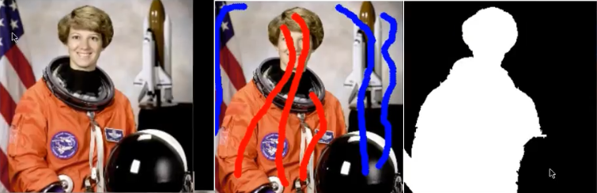
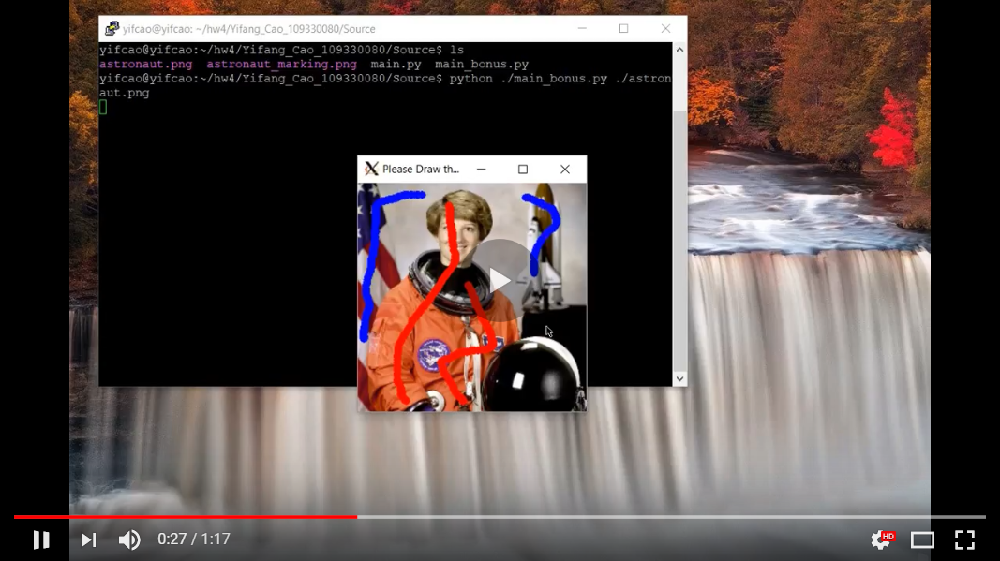

# Interactive_Image_Segmentation
This project is an OpenCV implementation of SLIC superpixels image segmentation techniques. Users can draw simple strokes on an image to select 'foreground' and 'background'. The project will then tranform the image into superpixels and separete user selected 'forground' from the 'background'.

Please check the video below to see more details. 

